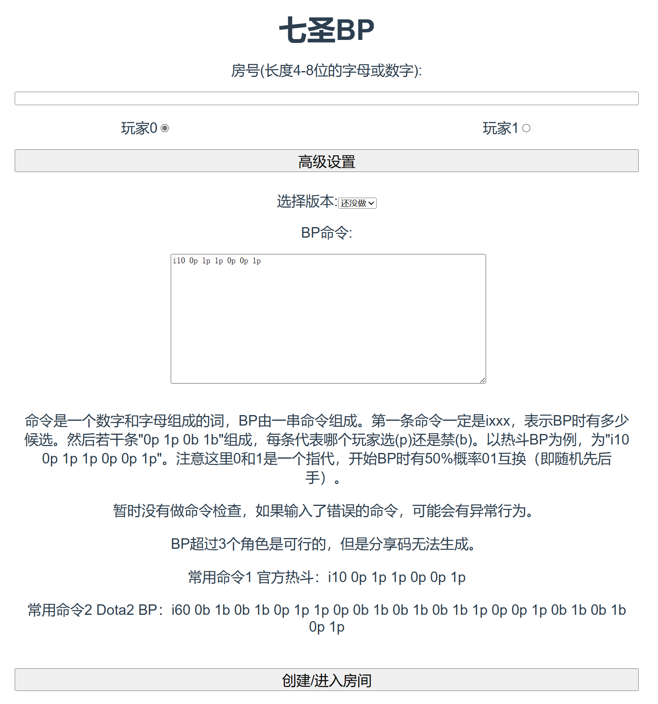

# 七圣BP工具

简单的用来进行七圣Ban-Pick的工具。以热斗列阵斗巧为模板。默认情况下和列阵斗巧一致，除了平常组牌没法带超过2张牌，所以会保证相同牌数量在2以下。在完成BP后会直接给出分享码，可以导入游戏。

也支持自定义BP，比如增加初始角色，禁用选用互相交叉等，可以通过高级选项实现。例子里给了展示所有角色，然后使用dota2规则进行BP的命令配置。

有一个简单的服务器，支持在线BP，一个服务器可以支持多桌BP。BP过程全程保存，可以断线重连。一桌生成超过10分钟后会被服务器自动删除。

目前只支持中文，涉及文字较少且文本文件来自于LPSim所以支持英语应该不难。

## 部署

分成了前端和后端。首先循环clone下来，然后进入frontend，执行`yarn && yarn build`来生成dist。然后在根目录运行`python server.py`即可。如果要改端口，可以在server.py里改。

## 界面

分成了欢迎界面和BP界面。

欢迎界面输入房间号、选择玩家编号，然后如果有必要展开高级选项并编辑，之后点击开始。如果该房间已存在会直接进入，否则会创建一个新房间。

BP界面左边是玩家0右边是玩家1，中间是BP池。上方会给出BP命令、房间有效时间等提示。如果轮到了你BP，BP池边框会闪烁。选择BP对象并点击按钮来BP，已禁和已选的会变红和变灰。任何时刻，点击角色会在BP池下方展示这个角色自带的装备牌（从列阵斗巧抄来的），点击装备牌会展示牌的说明。当BP完成时，如果是符合卡组构筑规则的BP，会随机用事件牌支援牌填充空余卡位并给出分享码，可以直接导入游戏。否则不会生成分享码，例如使用Dota2规则时会BP出5个角色，但是分享码只能包括3个，就不会给出分享码了。填充了空余卡位后，完成构筑的牌组会上传服务器，刷新重新进入房间获取到的是同一个牌组。

